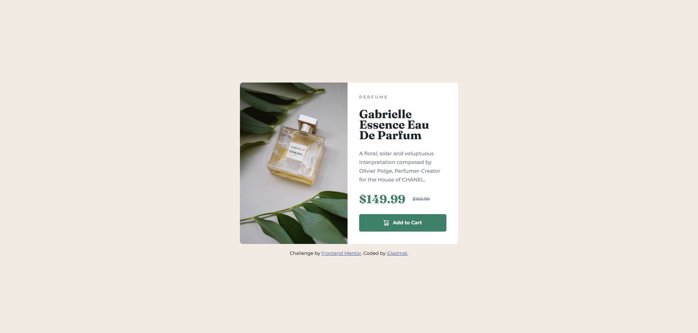

# Frontend Mentor - Product preview card component solution

## Table of contents

- [Overview](#overview)
  - [Screenshot](#screenshot)
  - [Links](#links)
- [My process](#my-process)
  - [Built with](#built-with)
- [Author](#author)

## Overview

### Screenshot

### Links

- Solution URL: [Solution Page](https://www.frontendmentor.io/solutions/product-preview-card-component-LumWd_XgiU)
- Live Site URL: [Deployment](https://iqadmat.github.io/product-preview-card-component/)

## My process

### Built with

- Semantic HTML5 markup
- CSS custom properties
- Flexbox
- CSS Grid
- Mobile-first workflow

## Author

- Linkedin - [Mudasir Ali](https://www.linkedin.com/in/iqadmat/)
- Frontend Mentor - [@iQadmat](https://www.frontendmentor.io/profile/iQadmat)
